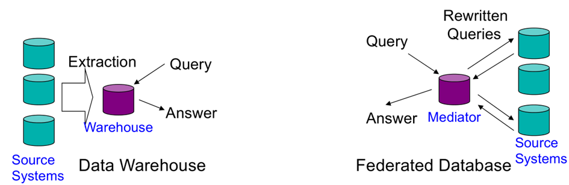

# Definition: Datenbank
Eine Datenbank ist ein integrierter, persistenter Datenbestand einschließlich aller relevanten Informationen über die dargestellte Information (Metadaten), der einer Gruppe von Benutzern zur Verfügung steht und durch eine spezielle Software möglichst redundanzfrei verwaltetet wird.

# Definition: Datenbankmanagementsystem (DBMS)
Ein Datenbankmanagementsystem (DBMS) ist die Gesamtheit aller Programme zur Erzeugung, Verwaltung und Manipulation einer Datenbank.

# Data Warehouse
- Eine übergreifende, zentrale Datenbasis
- Optimiert für Einfüge- und Lese-Operationen, nicht für Transaktionen
- Extract, Transform, Load (ETL) Tools
- eine entscheidungsunterstützende Datenbank die zusätzlich und separat von den Datenbanken des Unternehmens gepflegt wird
- Alle relevanten Unternehmensdaten werden gesammelt und verdichtet
- Diese gilt es zu strukturieren (Data-Mining, Data-Analysis)
- Bietet eine globale Perspektive unter Verwendung historischer Daten
- Schafft durch OLAP Werkzeuge die Basis für Business Intelligence
- Data Warehouses können aus kleineren Einheiten, sogenannten Data Marts gebildet werden
- Data Marts sind kleine Einheiten des Unternehmens wie z.B. Marketing, Verkauf etc.
- Dies kann Integrationsprobleme auf höheren Ebenen verursachen
- Zugriff auf gesamte Daten nicht einzelne Tupel



Welche Daten kommen da rein?
- Alle Daten (historische und aktuelle)
- mittels ETL Tools (Extract, Transform, Load) aus allen Datenquellen

Besonderheit dieser Daten?
- Daten sind idR verdichtet
- Relevante Unternehmensdaten

Wie kann das Schema aufgebaut sein?
- Star Schema
  - Besteht aus Faktentabellen und Dimensionstabellen
  - Faktentabelle enthält übergeordnete Informationen (z.B. Verkaufszahlen)
  - Dimensionstabelle enthält Basisdaten (z.B. Verkäufe)
- Snowflake
  - Verfeinerung des Star Schemas 
- Fact Constellations
  - Mehrere Faktentabellen teilen sich gleiche Dimensionstabellen


Welche Operation führt man da durch?
- READ überwiegend für Data Mining & Data Analysis
- WRITE zum einmaligen Befüllen
- WRITE once, READ many

Aus VL1


# OLTP (OnLine Transaction Processing)
Echtzeit Datenverarbeitung fürs Tagesgeschäft
- Viele Änderungsoperationen
- Zugriff auf einzelne Datensätze/Objekte
- Zugriff durch Mitarbeiter (Viele Nutzer)
- Zeitkritisch, immer aktuellste Daten

# OLAP (OnLine Analytical Processing)
Komplexe Analysen zur Strategieplanung
- Read only
- Betrachtung der Gesamtheit/Aggregation von Daten
- Erkenntnisse über Entwicklung des Unternehmens -> Strategieplanung
- Zugriff durch Analysten (wenige Nutzer)
- Zeit unkritisch, auch historische Daten akzeptabel


# Schwächen von relationalen Datenbanken
- Zentraler Ansatz (Großrechner)
- Begrenzte Skalierbarkeit (Nur Scale up, kein Scale out)
- Konsistenz als zentrales Paradigma
- Folge: Satzsperren -> geringerer Datendurchsatz

Aus VL 3 Folie 144

Versuch der Skalierung von RDBMS
- Master-Slave-Ansatz
  - Alle WRITEs gehen an den Master.
  - Gelesen wird von den Replicas/Slaves.
  - Problem: Replicas nicht direkt aktualisiert. READs könnten veraltete Daten lesen
  - Problem: WRITEs nicht skalierbar.  

# Multi-Version Concurrency Control (MVCC)
- Optimistische Nebenläufigkeit
- Ähnlich zu einem Versionskontrollsystem
- Schreibzugriffe erzeugen neue Version der Daten
- WRITEs deshalb ohne Sperren
- UPDATEs (in Place) gibt es nicht -> WRITE mit neuer Versionsnummer
- Folge: Hoher Datendurchsatz aufgrund weniger Sperren möglich

Funktionsweise 
- Nutzung von Zeitstempeln für Daten und Transaktionen
- READ Zugriffe erzeugen keine Sperre
- Lese- und Schreibzeitstempel je Version
- Anhand der Zeitstempel Ermittlung der neusten Version; ggf. Abort der Schreiboperation

Aus VL 3 Folie 145ff.

# Big Data
- 3Vs
  - Volume - herausfordernde Mengen
  - Variety - Verschiedenartigkeit und nur partiell strukturiert
  - Velocity - dynamischer Eingang von Daten und Ereignissen

Aus VL 3 Folie 159

# NoSQL (Not only SQL)
NoSQL sind skalierbare Datenbanken, die das Ziel haben, Datenmengen im Terabyte- oder sogar Peta-Bereich zu persistieren.

Schlüsseleigenschaften
- Nicht Relational
- Schema-Frei
- Verteilt und horizontal skalierbar (Scale out)
- Open Source (aus VL)
- Einfach bei Datenreplikation
- Zumeist einfache Programmierschnittstellen
- Verfolgt BASE (eventuell konsistent, aus VL)

Aus VL 3 Folie 169ff

# ACID vs BASE
Integritätsmodelle von Datenbanken
- ACID (relationale Datenbanken)
  - Atomarität (Ganze Transaktion erfolgreich oder gar nicht)
  - Konsistenz (DB wird in valid Zustand hinterlassen)
  - Isolation (Parallele Transaktionen verhalten sich so, als würden diese nacheinander passieren)
  - Dauerhaftigkeit (Committed = gespeichert, auch bei Stromausfall)
- BASE    
  - Basic Available (Anwendung funktioniert immer, manchmal mit geringerer Konsistenz)
  - Soft State (Zustand nicht zu jedem Zeitpunkt eindeutig)
  - Eventual Consistency  (Irgendwann konsistent..)
    
Aus VL 3 Folie 17x ff.

# Überblick populäre NoSQL Datenbanken
- Key/Value Speicher
  - Amazon DynamoDB (*)
  - Redis  
- Datei orientiert
  - MongoDB (*)
  - CouchDB
- Spalten orientiert
  - Google Big Table
  - Cassandra (*)
  - HBase (*)
    
Aus VL 3 Folie 193

# Key-Value-Speicher
Aufbau wie eine Hashmap

Funktion
- Speicherung eines Wertes zu einem Schlüssel
- Key meist gehasht
- Schnittstellen: PUT, GET, DELETE
- Scale Out möglich, da Key-Value-Paare auf verschiedenen Rechnern gespeichert werden können.

Ansätze
- Master-Directory
  - Mehrere Nodes speichern die Key-Value-Paare.
  - Master weiß, auf welchem Node welches Paar gespeichert ist.  
  - Zugriff als Recursive Query (Master liefert Value) oder Iterative Query (Master liefert Namen des Nodes)
- Fehlertoleranz
  - Daten werden auf mehreren Nodes gespeichert
- Load Balancing
  - Master überwacht Auslastung und wählt infolgedessen den perfekten Node zum Einfügen


# Chord-Ring
- Variante eines Key-Value-Speichers (Alternative zu Master/Slave Ansatz)
- Ermöglicht das Auffinden von Daten in einem verteilten Speicher (Auch bei Hinzunahme/Ausfall einzelner Knoten)

Eigenschaften
- Einfaches Konzept (beweisbare Korrektheit und kalkulierbare Performance)
- Jeder Chord-Knoten benötigt nur Informationen über einen Teil der anderen Knoten
- Lookups werden über Nachrichten mit anderen Knoten gelöst.

Aus VL 4 Folie 230ff.

Skalierbare Suche
- Mit jedem Hop wird die Distanz zum Zielknoten mindestens halbiert


# DynamoDB
- Key-Value-Speicher mit PUT & GET
- Verfolgt das Chord-Prinzip zum Auffinden der Knoten
- Replikation zur Verbesserung der Ausfallsicherheit
- Virtual Nodes zur gleichmäßigeren Bestückung des Chord Rings -> Leistungsfähiger/Load Balancing
- (ACID)

# Spaltenbasierten bzw. Wide Column Databases (Zusammensetzung der KEy Value Speicher)
- Zu einer Row-ID (Key) gibt es mehrere Spalten
- Speicherung Spaltenorientiert (Alle Werte in einer Spalte stehen zusammen)
- Column Families
  - Gruppierung mehrerer Columns
  - Speicherung der Row-ID + Column 1 Family A + Column 2 Family A ... Row-ID + Column 1 Family B + Column 2 Family B

# CAP Theorem
- Dreieck aus 
  - Consistency
  - Availability
  - Partition Tolerance
- Systeme erfüllen immer zwei davon 

Aus VL 3 Folie 179

# HDFS (Dateisystem)
- Open Source Variante des Google File Systems
- Cluster besteht aus
  - Namenode: Master eines Namespace im Dateisystem & Zugriffskontrolle
  - Datanode: Bedienen Anfragen (READ, WRITE) auf Basis der Anweisungen des Namenode
- Zentraler Verzeichnisbaum, verteilte Daten  

Aus VL6 Folie 323ff.

# Map & Reduce
- Scaling-out-Ansatz (mehrere Computer bearbeiten Teil der Anfrage)
- Parallele Verarbeitung
- Input Key-Value-Paare & Output Key-Value-Paare
- Signaturen
  - Mapper: `(K1, V1) -> list(K2, V2)`
  - Reducer: `(K2, list(V2)) -> list(K3, V3)`
  - Java Signatur: `void map(K1 key, V1 value, Mapper.Context context) throws IOException, InterruptedException`

Beispiel Word Count [see](https://github.com/V3lop5/Hadoop-WordCount/blob/master/src/main/java/MapClass.java)
```java
/**
 * Mapper
 * 
 * Konvertiert die Key-Value-Paare aus den Dateien in eine Liste von Key-Value-Paaren.
 * 
 * Erstellt aus Input (key: long, value: text)
 *      (42, "Hallo Welt")
 *      (43, "Hallo Peter")
 * den Output [(key: text, value: int)]
 *      [("Hallo", 1), ("Welt", 1)]
 *      [("Hallo", 1), ("Peter", 1)]
 */
public class MapClass extends Mapper<LongWritable, Text, Text, IntWritable> {
    
  private final static IntWritable one = new IntWritable(1);
  private Text word = new Text();
  
  @Override
  public void map(LongWritable key, Text value, Context context) throws IOException, InterruptedException {
    String line = value.toString();
    StringTokenizer itr = new StringTokenizer(line.toLowerCase(Locale.ROOT).replace('.', ' '));
    while (itr.hasMoreTokens()) {
      word.set(itr.nextToken());
      context.write(word, one);
    }
  }
}

/**
 * Reducer
 * 
 * Nimmt Ergebnis des Mappers entgegen. 
 * Zu jedem Key werden alle Values als Liste hinzugefügt.
 * 
 * Erstellt aus der Ausgabe des Mappers/Input (key: text, value: List[int])
 *      ("Hallo", [1, 1])
 *      ("Welt", [1])
 *      ("Peter", [1])
 *      
 * den Output [(key: text, value: int)]
 *      [("Hallo", 2)]
 *      [("Welt", 1)]
 *      [("Peter", 1)]
 */
public class ReduceClass extends Reducer<Text, IntWritable, Text, IntWritable> {
  private IntWritable count = new IntWritable();
  
  @Override
  protected void reduce(Text key, Iterable<IntWritable> values, Context context) throws IOException, InterruptedException {
    int sum = 0;
    for (IntWritable value : values) {
      sum += value.get();
    }
    count.set(sum);
    context.write(key, count);
  }
}
```

# Lokalitätsprinzip
- Zeitliche Lokalität - Was zuletzt gelesen wurde, wird mit hoher Wahrscheinlichkeit erneut benutzt.
- Räumliche Lokalität - Benachbarte Adressbereiche werden angesprochen.


# Yarn Scheduler (Yet Another Resource Negotiator)
- Framework zur Verwaltung von Map-Reduce Tasks im HDFS Cluster
- Komponenten
  - Global Resource Manager (RM): Übernahme des Scheduling
  - Per-server Node Manager (NM): Überwachung und Anbindung eines einzelnen Nodes
  - Per-application (job) Application Master (AM): Container zur Kapselung der Kommunikation zwischen RM und NM

Aus VL8 Folie 416


# RDD (Resilient Distributed Dataset) Konzepte (lazy)
- robuster verteilter Datensatz
- RDD-Objekte liegen im Arbeitsspeicher
- RDD-Objekte sind nach Erzeugung unveränderlich

# SPARK 
- Gedacht für Analysen! (Lesender Zugriff)
- Für Batch und Interaktive Anwendungen gedacht
- In Echtzeit Daten als Stream
- Hohe Geschwindigkeit -> Dank Arbeitsspeicher
- Keine persistente Datenspeicherung -> Alles geschieht im Arbeitsspeicher
- Für OLAP geeignet
  - Spark stellt ML Bibliotheken als Analysemethoden bereit
  - Streaming

Aus VL12

# PIG (Abfragesprache für Hadoop)
- Datenflussorientierte Scriptsprache
- Für Programmierer (zum Abruf einzelner Tupel)
- Client für Hadoop
- Höhere Abstraktion von Map/Reduce
- Ermöglicht Joins
- Operationen
  - LOAD - Laden von Daten
  - FOREACH - Projektion
  - GROUP - Gruppierung
  - DUMP - Ausgabe
  - AVG/MIN/MAX/.. - Aggregationen
- Ausführung auf Clientseite (erzeugt Map/Reduce Task auf Server)
  
Aus VL 9 Folie 450ff.

# HIVE (Abfragesprache für Hadoop)
- Hive Query Language ähnlich zu SQL
- Für Data Analysts
- Client für Hadoop
- Ermöglicht Abfragen, wie von relationalen Datenbanken bekannt
- Im Prinzip ein Data Warehouse
- Ausführung auf Serverseite
  
Aus VL 9 Folie 465ff.

# HBase (Datenbank)
- Idee CP (Consistency & Partition Tolerance)
- Basiert auf HDFS & adressiert dessen Nachteile
- Sinnvoll für Random Read/Write
- Versuch einer spaltenorientierten Datenbank
- Spalten in Regions gespeichert   
- HBase besteht aus
  - Region Server: Stellt Datenregionen bereit 
  - HBase-Master: Koordinierung der Region Server
  - (Zookeeper: System Manager aller Server für HBase und HDFS)
  
Aus VL 7 Folie 375

# Hadoop Framework
- Nutzt HDFS und HBase
- Laufzeitumgebung MapReduce mit verschiedenen Tools HIVE, PIG, Zookeeper
- Open Source Variante der Google-Produkte

Aus VL 6 Folie 320ff.

# Cassandra Datenbank
- Idee AP (Availability & Partition Tolerance)
- Spaltenbasiert
- Nutzt Chord-Ring
- Kein Master, sondern gleichberechtigte Knoten  
- Deshalb: Skalierbare & fehlertolerante Datenbank
- Consistency für WRITE und READ getrennt einstellbar (Definition, wie viele Replicas abgefragt werden.)
- WRITE often, READ less
- Im Gegensatz zu Hadoop ist Cassandra Standalone
- Abfragesprache: CQL (Cassandra Query Language)

Partitioner:
- Random Partitioner: Die Schlüssel werden gleichmäßig über die Nodes verteilt (wie bei DynamoDB und default in Cassandra)
- Order Perserving Partitioner: berücksichtigt die Ordnung der Schlüssel (gut für Bereichabfragen, kann Lastverteilung unterlaufen)

Replikation:
- Simple Strategy: Replikas im Uhrzeigersinn (wie bei DynamoDB)
- Networkt Topology Strategy: Replikas werden auf anderen Racks oder Datenzentren verteilt 

Wie würde man eine Zeitreihendatenbank anlegen?
- Mittels CQL
- Order Perserving Partitioner mit Event-Time absteigend

Aus VL 10 Folie 551

# MongoDB 
- Positioniert sich zwischen Key-Value-Speichern und RDBMS
- Objektorientiert
- Dokumente im JSON Format (Je Dokument Key/Value Speicher)
- Schemafrei, Skalierbar
- Open Source

Fazit
- Ansatz passt zu REST
- Serialisierte Objekte entsprechen dem Modell der Programmiersprache  
- Nachteil: Hoher Grad an Denormalisierung.
- Folge: Informationen mehrfach gespeichert.

Aus VL12 Folie 735ff.

# Entscheidungsbaum
- Modell zur Klassifikation
- Dafür wird aus Trainingsdaten eine Baumstruktur aufgebaut.

Aufbau des Entscheidungsbaums:
- Falls alle Sätze der Trainingsmenge richtig klassifiziert sind, setzte Klassifizierung C
- Sonst:
  - Bestimmte Attribut mit höchstem Informationsgehalt/Entscheidungssicherheit (geringe Entropie)
  - Setze dieses Attribut als Wurzel  
  - Teile Trainingsmenge in entsprechende Teilmengen und erstellte Teilbäume


# DB-Scan (Density-Based Clustering)
- Gruppierung der Punkte anhand der Dichte
- Problematisch, wenn Dichte ungleich verteilt ist
- Drei Arten von Punkten
  - Core Points: Wenn Radius um Punkt eine Mindestanzahl an Punkten enthält.
  - Boarder Points: Wenn Radius um Punkt Core Points einschließt, aber Mindestanzahl an Punkten nicht erfüllt ist.
  - Noise Points: Wenn Radius um Punkt keine Core Points enthält & auch nicht die Mindestanzahl erfüllt.

Aus VL 11 Folie 673ff.

Alternativen:


# Clustering
- Unsupervised Learning
- Grundidee des Algorithmus
  1. Berechne die Abstandsmatrix
  2. Initialisiert Cluster mit jeweils einen Punkt
  3. REPEAT
     1. MERGE der beiden nächsten Cluster
     2. UPDATE der Abstandsmatrix
  4. UNTIL Anzahl der gewünschten Cluster erreicht
- Verfahren
  - hierarchical
  - k-means
  - x-means
  - k-medoid
  - fuzzy c-mean

Aus VL 11 

# Quorum
- Nicht alle Replicas eines Datensatzes müssen bei Schreibvorgängen direkt aktualisiert werden. (Können asynchron zu einem späteren Zeitpunkt erfolgen.)
- Konfiguration über Tupel (N, R, W)
- In Summe gibt es N Knoten (bzw. Replicas, die eine Kopie der Datei gespeichert haben).
- Bei lesendem Zugriff müssen R Knoten antworten, damit Wert als gelesen gilt.
- Bei schreibendem Zugriff müssen W Knoten den Schreibvorgang bestätigen.
- Wenn R+W > N ist Konsistenz erfüllt. (Überschneidung = Konsistenz)
- (Manchmal auch W > N/2)
- Vorteil: Die Performance steigt, weil nicht alle Replika direkt aktualisiert werden müssen

- Problem1: wenn es zu bestimmten Partitionen kommt, kann es dazu kommen das keine Write/Read Quoren erreicht werden können.
- Ausfall von einzelnen Knoten kann zum Problem werden. 

Eine Lösung: Sloppy Quorum

VL4 Folie 270ff.

# Sloppy Quorum
- Beim Ausfall von Knoten können andere ihre Aufgabe übernehmen
- Quorum-Bedingung wird erfüllt. Aber wir erlauben Knoten, die nicht im Besitz der richtigen Information sind
- Hinted Handoff wird angewandt: Kommt der Knoten wieder zurück und bekommt eine Hint vom Vertreter das er wieder seine Rolle als Replika wahrnehmen soll.
- Vorteil: Einzelne Knoten können temporär ausfallen.

- **Achtung**: Während ein Knoten ausgefallen ist, kann theoretisch eine Inkonsistenz vorliegen.
- Deshalb auch `Sloppy`

# Bloom Filter
- Teil in Cassandra
- Datenstruktur zur Ermittlung welche Daten schon mal vorgekommen sind und welche erstmals auftreten

# Chord Ring Übungsaufgaben
- Fingertabelle aufstellen
  - Zuerst Bereiche definieren (immer 2er Potenz addieren)
  - Nächsten Knoten je "Bereich von" ermitteln
- Hinzufügen
  - In Fingertablle nach Bereich für neuen Knoten suchen & an diesen weiterleiten
- Stabilisierungsverfahren
  - Nachfolger nach seinem Vorgänger fragen
  - Wird in regelmäßigen Abständen ausgeführt
  
  
  
TODO VL 4 PDF seite 33, 40